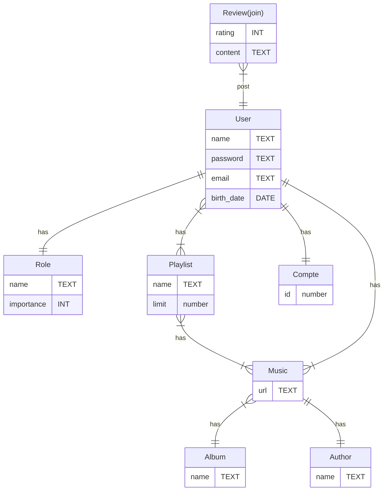

# Spoutoufy

### 1 Titre du projet : Spoutoufy

### 2 Description :

Une application d'écoute de musique, de like/dislike. Possibilité de créer ses playlist avec ces titres likés. 
Discuter en live avec des autres utilisateurs, moyen d'abonnement ?

## 3 Case UML : 

## 4 Définir les entités du projet : 

- Utilisateurs 
- Musique => Playlist
- Tchat
- Abonnement ?

## 5 EntityRelationUML :  

## 6 Stack et architecture du projet :
- Angular pour le Front.
- NodeJS/Express pour l'API Rest.
- Sequelize pour SQL.
- Stripe pour le paiement d'abonnement.

## 7 Maquette FIGMA : 
https://www.figma.com/design/ubu4SuQgmNyzccVLJygUGo/Untitled?node-id=203-1475&t=vqKTwJqjSJuRtkq2-1

## 8 Cahier des charges : 
- Page d'accueil :
    * Derniers titres likés.
    * Menu Profil.
    * Nos playlists ?

- Page PROFIL
    * Connexion.
    * Déconnexion.
    * Possibilité de s'abonner ?
       Utilité ? IDK
      
    * Modifie son profil :
      * Name
      * Adress
      * Photo ?
        
    * Rôles :
        * Guest :
              * Possible de tout voir et accès à toutes les fonctionnalités
        * User :
              * ??

- Header avec barre de recherche.
- Différents albums et ses musiques?

- **Priorité pouvoir lire une musique** 
