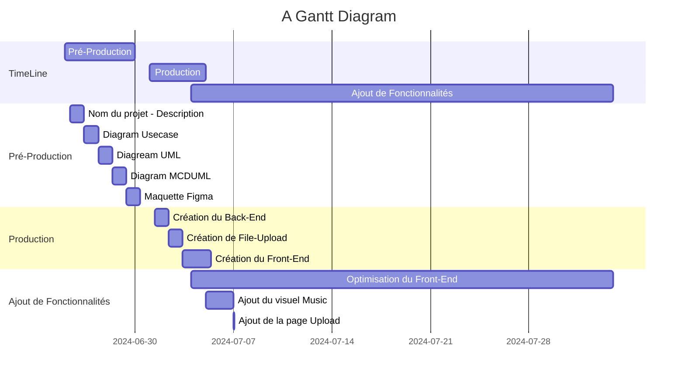

# Spoutoufy
## Gantt 




## 5 EntityRelationUML :  
```mermaid
erDiagram
    Album{
        name TEXT
    }
    Music_images{
    }
    
    User{
        name TEXT
        password TEXT
        email TEXT
        birth_date DATE
    }
    Music{
        url TEXT
    }
    Role{
        name TEXT
        importance INT
    }
    Playlist{
        name TEXT
        limit number
    }
    Compte{
        id number
    }
    Author{
        name TEXT
    }
