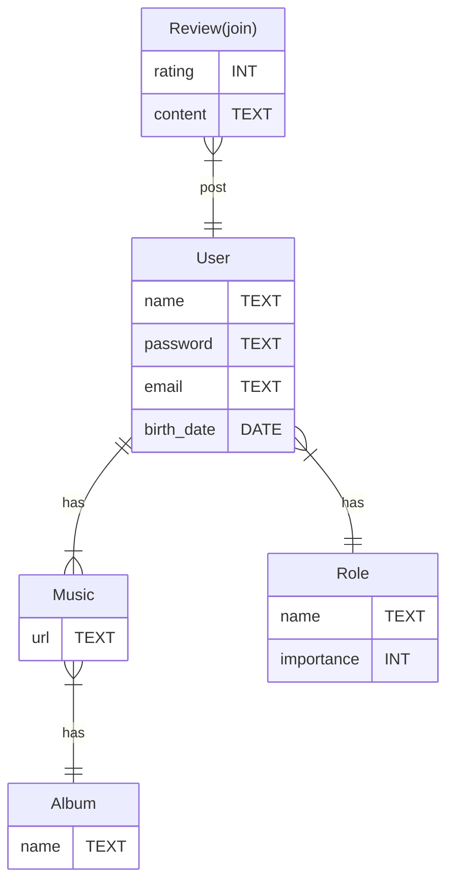

# Spoutoufy

### 1 Titre du projet : Spoutoufy

### 2 Description :

Une application d'écoute de musique, de like/dislike. Possibilité de créer ses playlist avec ces titres likés. 
Discuter en live avec des autres utilisateurs, moyen d'abonnement ?

## 3 Case UML : 

https://app.diagrams.net/?tags=%7B%7D&highlight=0000ff&edit=_blank&layers=1&nav=1&title=Diagramme%20sans%20nom.drawio#R%3Cmxfile%3E%3Cdiagram%20name%3D%22Page-1%22%20id%3D%22WNwYlhyQJeTWNwRam7LL%22%3E7VhNc5swEP01PqYDyNhwtB2nPSStZ9Jpm1NGBgXUCkSF8Ed%2BfVcgbL7sOokdZ9Lm4Ggfq5X09mmF6KFJtPoocBLecJ%2BwnmX4qx667FkWsh0b%2FilkXSCmM9BIIKhfYMYWuKWPRDuWaEZ9kmqsgCTnTNKkDno8joknaxgWgi%2Frbg%2Bc%2BTUgwQGpTUMBtx5mpOX2nfoyLFDHGm7xT4QGYTmyOXCLJxEunXXgNMQ%2BX1YgNO2hieBcFq1oNSFMsVfn5WrH083EBInlIR1sMV9c4bvHe%2FPLjfM1WHmfv91foCLKArNML3jkSS70jOW6pAEmn6hmFrHCAY0XREgKRF3jOWEznlJJeQwucy4ljyoOI0YD9UDyBNBQRgwME5o8k4zGZLJJnQGgnhD0JaudKzU3%2FIHyCI%2BIFGtw0R0uLMPWnbTsLpyhzsKykkStxLCaP2egtaN1E2yib6mFhmb3CUz3W0w%2FCByRfUxf5Q5ovAypJLcJ9hS%2BhI1WpzHhNJZETBdAT3pEFk3XarBoGrbbptE12jzaVv9EPFp2izLiw5bVZsxjRZmXiQXxNUGCZ7GfW4oaLmTIAx6DcrlSZO7yk0i51tUHZ5LXGX7gsdQPTWBsnEosSsABm8R%2BxSrmpya1n3lYA8%2BER%2FYsVosRhguI3EdKvzuVgjAs6aI%2BkaOnZNCSds8aMJjv2KcLaAaqORG9CeqNXCLUcQAlHRhheM1oCqLV7jB6pUdHkBKaiybS7NqUCGNwYhywmY6ycYblIVBuHNc0W%2FvGdNyO%2BoOMEyWpPFArWbqmv6D%2BGDyDn0uastw8K3G2gVoV5%2BzMWegfqjilUP9ackyjO5evU3LKae6vOVMPXjF0wYEfhtV7WZbS39DnvZect7BzQLoHZAlKj6fTlICuMSzZMrJYZaw4MvIsvvuEDe3B2fPldOSryVLsj9S9CiyP4TSlXp2ceul7Wh2r1VCyovJHpX2nQn5AjT%2F98HKlB8yNdcWYEUGBHZCXxmJg6kcey7CHJVAEH5r9EtgGzK111WqGPGL5RQdW30G3uirSsbveyjV2cI3WI8zUDaMqXsfdJd4ySrFS3bF6K23H6jdiOUYjVsFGK1Yu8c3iX3C%2Bd50l70z1Z5CouaMCvpZG3VKSG426znM1Ouw7TY02Yp1ao10n6X%2BNvlij1pk12m9q1Hm%2BRlFDoy29n1qj7U9cM9AUDvJXu7R55X9bF82T3tDB3H7nLejefi5H0z8%3D%3C%2Fdiagram%3E%3C%2Fmxfile%3E

## 4 Définir les entités du projet : 

- Utilisateurs 
- Musique => Playlist
- Tchat
- Abonnement ?

## 5 EntityRelationUML :  

## 6 Stack et architecture du projet :
- Angular pour le Front.
- NodeJS/Express pour l'API Rest.
- Sequelize pour SQL.
- Stripe pour le paiement d'abonnement.

## 7 Maquette FIGMA : 
https://www.figma.com/design/ubu4SuQgmNyzccVLJygUGo/Untitled?node-id=203-1475&t=vqKTwJqjSJuRtkq2-1

## 8 Cahier des charges : 
- Page d'accueil :
    * Derniers titres likés.
    * Menu Profil.
    * Nos playlists ?

- Page PROFIL
    * Connexion.
    * Déconnexion.
    * Possibilité de s'abonner ?
       Utilité ? IDK
      
    * Modifie son profil :
      * Name
      * Adress
      * Photo ?
        
    * Rôles :
        * Guest :
              * Possible de tout voir et accès à toutes les fonctionnalités
        * User :
              * ??

- Header avec barre de recherche.
- Différents albums et ses musiques?

- **Priorité pouvoir lire une musique** 
